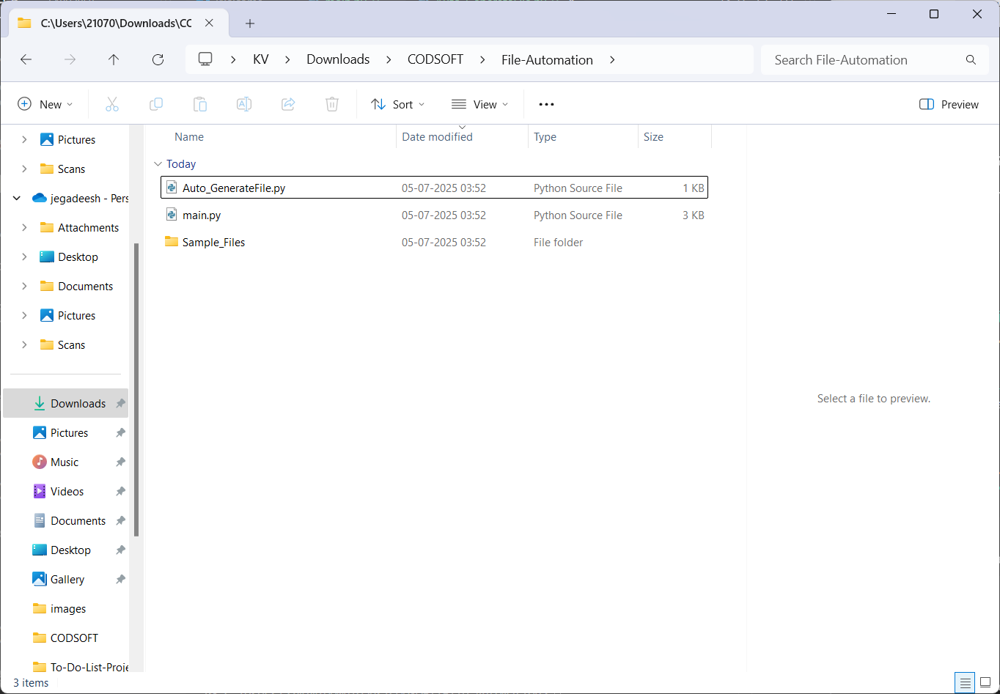
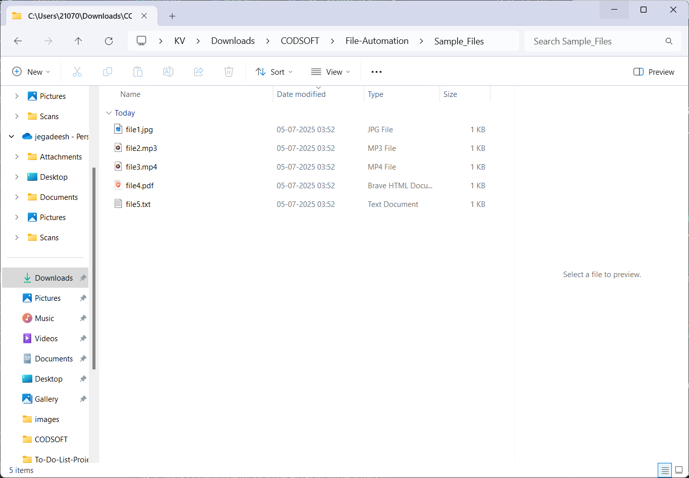
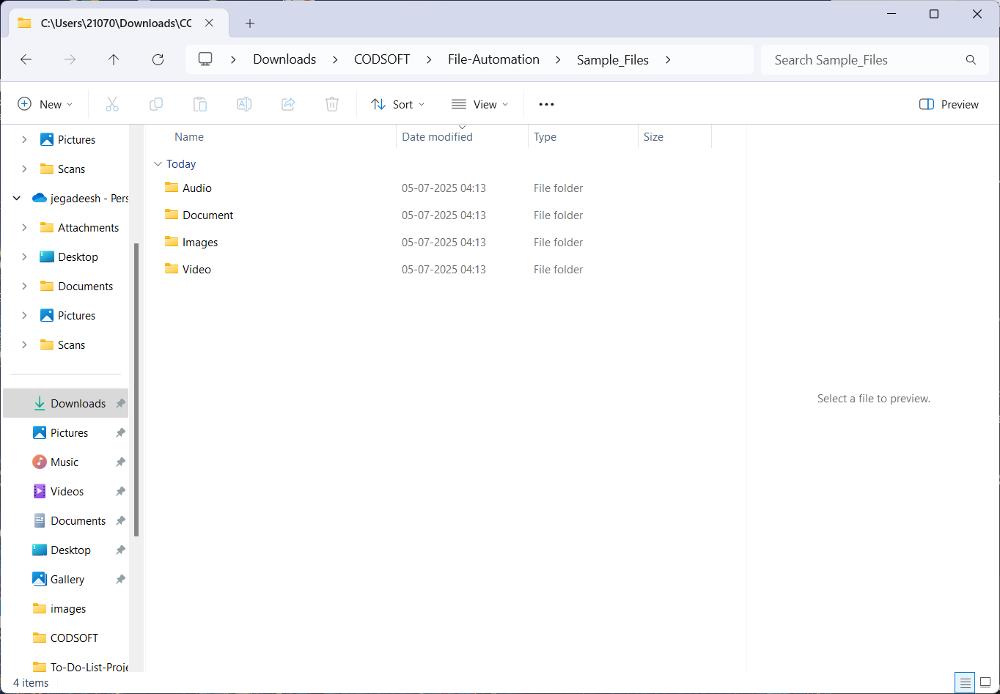

# 🗃️ File Automation Script with Python

This is a Python script that automatically organizes files in a directory into folders based on their file types — images, audio, video, and documents.  
It helps keep your folders clean and organized 💼✨

---

## 📂 Example Folder Structure (After Running)

Sample_Files/
├── Images/
│ └── file1.jpg
├── Audio/
│ └── file2.mp3
├── Video/
│ └── file3.mp4
├── Document/
│ ├── file4.pdf
│ └── file5.txt
 

---
## Auto_Generate_Files_Folder


## 🧪 Before & After

### 🔸 Before Sorting:


### 🔸 After Sorting:


---

## 🚀 How to Use

1. Clone the repo or download the `.py` file.
2. Run the script in your terminal:
```bash
python file_automation.py

3.Enter the full path to the folder you want to organize.

4.Confirm sorting with y or n.

5.Done! Check the folder for neatly sorted subfolders.


File Types Handled

| Type      | Extensions             |
| --------- | ---------------------- |
| Images    | .jpg, .png, .jpeg      |
| Audio     | .mp3, .wav, .aac       |
| Video     | .mp4, .mov, .avi, .mkv |
| Documents | .txt, .docx, .pdf      |

🛠️ Built With
Python os, shutil

Class-based OOP design

Terminal input/output

Error handling

Folder detection logic

✅ Features
Skip folders while sorting

Summary count after organizing

User-friendly terminal UI

Handles upper/lower case extensions

Safe to rerun — won’t crash on folders

🙌 Author
Made with 💻 and ☕ by Jegadeesh (Jack) Nandakumar
